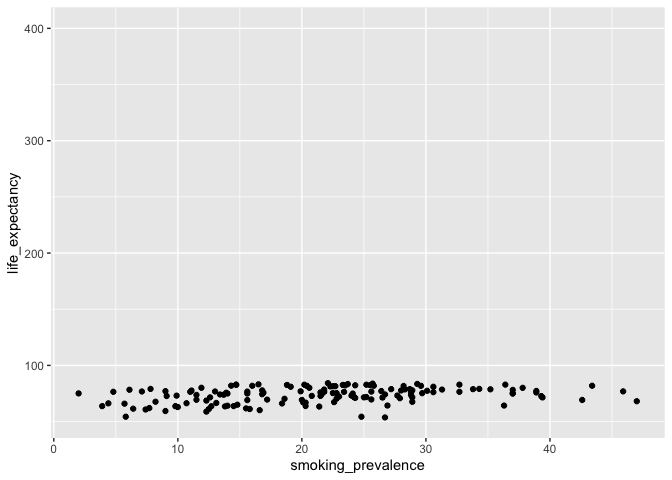
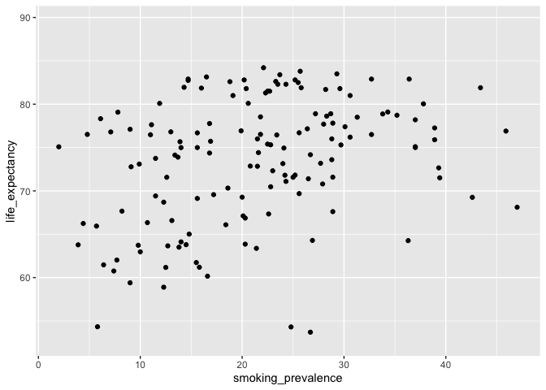

# Introduction to SQL
Sean Davis

# Introduction and background

We’re going to delve into the world of SQL, which stands for Structured
Query Language. SQL is a powerful tool used to manage and manipulate
structured data, and it plays a crucial role in the field of
epidemiology and biostatistics, business, biomedical research,
healthcare, and basically anywhere data are available.

## Structured Data in SQL

Structured data in the context of SQL refers to organized and
well-defined data. Think of it as data that follows a specific
structure, *like a well-organized spreadsheet*. In epidemiology and
biostatistics, we often deal with large datasets containing information
about diseases, patients, treatments, and various other factors.

For example, imagine you have a dataset with information about patients,
including their age, gender, medical history, and the type of treatment
they received. Each piece of information is stored in a structured
manner, making it easier to analyze and extract meaningful insights.

## SQL is based on Relational Algebra

Now, let’s touch upon the basis of SQL in relational algebra. Relational
algebra is a mathematical concept that forms the foundation of
relational databases, and SQL is essentially a language built upon these
principles.

In epidemiology and biostatistics, we can draw parallels between
relational algebra and the relationships we often explore in our
datasets. The fundamental concepts include:

- Relations (Tables)  
  In SQL, tables are used to store data. Each table represents a
  relation, such as a table containing patient information or a table
  with details about different medical procedures.

- Attributes (Columns)  
  Attributes are the characteristics or properties of the data. In a
  table representing patients, attributes could include age, gender, and
  medical history.

- Tuples (Rows)  
  Tuples are individual data entries within a table. Each row in our
  patient table could be a tuple representing a specific patient’s
  information.

- Operations  
  Relational algebra defines operations that can be performed on
  relations, such as selection (choosing specific rows), projection
  (choosing specific columns), and joining tables based on common
  attributes.


## SQL vs R/dplyr and python/pandas

SQL (Structured Query Language), R with dplyr, and Python with pandas
are all powerful tools for data manipulation and analysis, but they
serve different purposes and have distinct strengths. The choice between
them depends on various factors, including the task at hand, personal
preferences, and the specific requirements of the project. Here are some
reasons why someone might choose SQL over R/dplyr or Python/pandas:

### Database Interaction:

- SQL  
  SQL is specifically designed for interacting with relational
  databases. If your data is stored in a relational database, using SQL
  allows for efficient querying, updating, and managing of data directly
  within the database.

- R/dplyr and Python/pandas  
  While both R and Python can interact with databases, SQL is often more
  optimized and straightforward for working with relational databases.

### Performance:

- SQL  
  Database systems are optimized for SQL queries, and performing
  operations directly within the database can be more efficient,
  especially when dealing with large datasets.

- R/dplyr and Python/pandas  
  These tools are more versatile and can handle various data
  manipulation tasks, but they may not be as optimized as SQL for
  database-specific operations.

### Data Cleaning and Transformation:

- R/dplyr and Python/pandas  
  These tools offer a wide range of functions and methods for data
  cleaning, transformation, and analysis. They are well-suited for tasks
  that involve complex data manipulations, statistical analyses, and
  machine learning.

- SQL  
  While SQL can perform basic data manipulations, it may be less
  expressive than R/dplyr or Python/pandas for complex transformations
  and analyses.

### Integration with Other Tools:

- R/dplyr and Python/pandas  
  These tools seamlessly integrate with a wide range of data science
  libraries, machine learning frameworks, and visualization tools. They
  are part of larger ecosystems that support end-to-end data analysis
  workflows.

- SQL  
  SQL is often used in conjunction with other tools and languages. It is
  crucial for database management and can be part of a broader data
  processing pipeline.

### Personal Preference and Familiarity:

- SQL  
  Some individuals or organizations may have a strong preference for
  SQL, especially if they have a background in database management or if
  their data is primarily stored in relational databases.

- R/dplyr and Python/pandas  
  Data scientists and analysts who are more comfortable with programming
  languages like R or Python may prefer using these tools for their
  flexibility and extensibility.

In practice, many data professionals use a combination of these tools,
leveraging the strengths of each depending on the specific requirements
of their tasks. It’s not uncommon to use SQL for database interactions
and initial data extraction, followed by R/dplyr or Python/pandas for
more complex data manipulation and analysis.

# Covid-19 open dataset

Google maintains a public dataset containing information about the
Covid-19 pandemic. The dataset is updated daily and contains information
about cases, deaths, vaccinations, and other factors. The data is
available in CSV format, which is a common format for storing structured
data.

We can download the data into our own tools and systems to analyze the
virus’s spread or decline, investigate COVID-related deaths, study the
effects of different vaccines, and more in 20,000-plus locations
worldwide.

We’ll be using this dataset to explore SQL and relational databases. The
dataset is available at the following link:

- <https://health.google.com/covid-19/open-data/raw-data>

# Setup for SQL

## We need a database

When working with SQL, we need a database to store our data. A database
is a collection of data that is organized in a structured manner. We can
think of a database as a container that holds our data and allows us to
perform operations on it. We can create, read, update, and delete data
from a database, and we can also perform more complex operations such as
joining data from multiple tables.

We’ll be using a relatively new database system called
[DuckDB](https://duckdb.org/). DuckDB is an embeddable SQL OLAP database
management system. DuckDB is ACID compliant and supports multi-threaded
query execution and vectorized query execution. DuckDB is written in C++
and is available under the permissive MIT License, making it free and
open-source software.

The video below provides a brief introduction and tutorial for using
DuckDB.

<iframe width="560" height="315" src="https://www.youtube.com/embed/ZX5FdqzGT1E?si=q3Vi13Oe7NHpI2-V" title="YouTube video player" frameborder="0" allow="accelerometer; autoplay; clipboard-write; encrypted-media; gyroscope; picture-in-picture; web-share" allowfullscreen>
</iframe>

To use DuckDB in Rstudio, we’ll need to install the `duckdb` and `DBI`
packages.

``` r
install.packages(c('duckdb', 'DBI'))
```

Normally, the database would be running in a separate process or perhaps
even on another machine somewhere. Commmon database systems include
MySQL, PostgreSQL, and Oracle and each of these systems has its own
advantages and disadvantages. No matter which system you use, you’ll
need to connect to the database. After doing so, SQL queries can be
executed against the database and they will look very similar or the
same to the SQL we write here.

## We need to connect to the database

At this point, we need to “connect” to the database. R uses a common
approach to connecting to databases called the Database Interface, or
[DBI](https://dbi.r-dbi.org/).

To do so, we need to load the `duckdb` and `DBI` packages and then use
the `dbConnect()` function to connect to the database.

``` r
library(duckdb)
```

    Loading required package: DBI

``` r
library(DBI)
con <- dbConnect(duckdb::duckdb(), ":memory:")
```

If we had a database running on another machine, we would need to
provide the connection information to the `dbConnect()` function. The
`con` variable is a connection object that we can use to interact with
the database.

``` r
con
```

    <duckdb_connection ef8c0 driver=<duckdb_driver 5fe70 dbdir=':memory:' read_only=FALSE bigint=numeric>>

For the first part of this tutorial, we’ll be using a nice feature of
Rstudio that allows us to use `SQL` chunks in our notebooks. The goal is
to get familiar with SQL and relational databases. Later, we’ll switch
to using R to interact with the database.

## We need to load the data into the database

For the purposes of this tutorial, we’ll be using the Covid-19 open data
dataset.

The following stuff is just to get the data into the database. Often,
data will be loaded into the database by someone else and we’ll just
need to connect to the database and start querying it. For the time
being, just run the code and don’t worry about the details.

``` sql
install httpfs;
load httpfs;
```

``` sql
create table 
health
as 
select * from read_csv_auto('https://storage.googleapis.com/covid19-open-data/v3/health.csv')
```

``` sql
create table
locations
as
select * from read_csv_auto('https://storage.googleapis.com/covid19-open-data/v3/index.csv')
```

# Working with data in the database

## High-level overview

Now that we have the data loaded into the database, we can start to
explore it. To get a list of tables (relations) in the database, we can
use the `SHOW TABLES` command.

``` sql
SHOW TABLES
```

| name      |
|:----------|
| health    |
| locations |

2 records

Those tables are the ones we just loaded into the database from the CSV
files. Take a look back at the code above to see how we did that. The
`CREATE TABLE` command is used to create a table in the database.

To see the columns in a table, we can use the `DESCRIBE` command.

``` sql
DESCRIBE health
```

| column_name                 | column_type | null | key | default | extra |
|:----------------------------|:------------|:-----|:----|:--------|------:|
| location_key                | VARCHAR     | YES  | NA  | NA      |    NA |
| life_expectancy             | DOUBLE      | YES  | NA  | NA      |    NA |
| smoking_prevalence          | DOUBLE      | YES  | NA  | NA      |    NA |
| diabetes_prevalence         | DOUBLE      | YES  | NA  | NA      |    NA |
| infant_mortality_rate       | DOUBLE      | YES  | NA  | NA      |    NA |
| adult_male_mortality_rate   | DOUBLE      | YES  | NA  | NA      |    NA |
| adult_female_mortality_rate | DOUBLE      | YES  | NA  | NA      |    NA |
| pollution_mortality_rate    | DOUBLE      | YES  | NA  | NA      |    NA |
| comorbidity_mortality_rate  | DOUBLE      | YES  | NA  | NA      |    NA |
| hospital_beds_per_1000      | DOUBLE      | YES  | NA  | NA      |    NA |

Displaying records 1 - 10

``` sql
DESCRIBE locations
```

| column_name     | column_type | null | key | default | extra |
|:----------------|:------------|:-----|:----|:--------|------:|
| location_key    | VARCHAR     | YES  | NA  | NA      |    NA |
| place_id        | VARCHAR     | YES  | NA  | NA      |    NA |
| wikidata_id     | VARCHAR     | YES  | NA  | NA      |    NA |
| datacommons_id  | VARCHAR     | YES  | NA  | NA      |    NA |
| country_code    | VARCHAR     | YES  | NA  | NA      |    NA |
| country_name    | VARCHAR     | YES  | NA  | NA      |    NA |
| subregion1_code | VARCHAR     | YES  | NA  | NA      |    NA |
| subregion1_name | VARCHAR     | YES  | NA  | NA      |    NA |
| subregion2_code | VARCHAR     | YES  | NA  | NA      |    NA |
| subregion2_name | VARCHAR     | YES  | NA  | NA      |    NA |

Displaying records 1 - 10

## `SELECT`ing data from the database

The `SELECT` command is the most commonly used command in SQL and it is
used to retrieve data from the database. The best way to understand SQL
is to see it in action, so let’s start with a simple example.

``` sql
SELECT * FROM health LIMIT 10
```

| location_key | life_expectancy | smoking_prevalence | diabetes_prevalence | infant_mortality_rate | adult_male_mortality_rate | adult_female_mortality_rate | pollution_mortality_rate | comorbidity_mortality_rate | hospital_beds_per_1000 | nurses_per_1000 | physicians_per_1000 | health_expenditure_usd | out_of_pocket_health_expenditure_usd |
|:-------------|----------------:|-------------------:|--------------------:|----------------------:|--------------------------:|----------------------------:|-------------------------:|---------------------------:|-----------------------:|----------------:|--------------------:|-----------------------:|-------------------------------------:|
| AD           |              NA |               33.5 |                 7.7 |                   2.7 |                        NA |                          NA |                       NA |                         NA |                     NA |          4.0128 |              3.3333 |             4040.78662 |                           1688.12146 |
| AE           |          77.814 |               28.9 |                16.3 |                   6.5 |                    69.555 |                      44.863 |                     54.7 |                       16.8 |                     NA |          5.7271 |              2.5278 |             1357.01746 |                            256.03449 |
| AF           |          64.486 |                 NA |                 9.2 |                  47.9 |                   237.554 |                     192.532 |                    211.1 |                       29.8 |                    0.5 |          0.1755 |              0.2782 |               67.12265 |                             50.66591 |
| AG           |          76.885 |                 NA |                13.1 |                   5.0 |                   126.917 |                      83.136 |                     29.9 |                       22.6 |                     NA |          4.5171 |              2.9560 |              673.85968 |                            235.74904 |
| AL           |          78.900 |               28.7 |                 9.0 |                   7.8 |                    93.315 |                      49.486 |                     68.0 |                       17.0 |                     NA |          3.6495 |              1.2164 |                     NA |                                   NA |
| AM           |          74.945 |               24.1 |                 6.1 |                  11.0 |                   173.428 |                      65.595 |                     54.8 |                       22.3 |                    4.2 |          6.1070 |              4.4023 |              407.63586 |                            343.83298 |
| AO           |          60.782 |                 NA |                 4.5 |                  51.6 |                   327.044 |                     220.291 |                    118.5 |                       16.5 |                     NA |          0.4075 |              0.2146 |              114.45964 |                             39.05479 |
| AR           |          76.520 |               21.8 |                 5.9 |                   8.8 |                   147.086 |                      79.483 |                     26.6 |                       15.8 |                     NA |          2.5996 |              3.9901 |             1324.60352 |                            198.93594 |
| AT           |          81.800 |               29.6 |                 6.6 |                   2.9 |                    79.032 |                      41.779 |                     15.3 |                       11.4 |                     NA |          7.0899 |              5.1697 |             4939.87549 |                            948.61743 |
| AT_1         |          81.500 |                 NA |                  NA |                    NA |                        NA |                          NA |                       NA |                         NA |                     NA |              NA |                  NA |                     NA |                                   NA |

Displaying records 1 - 10

The `SELECT` command is followed by a list of columns to select from the
table. In this case, we used `*` to select all columns. The `FROM`
command is followed by the name of the table to select from. The `LIMIT`
command is used to limit the number of rows returned by the query.
Without the `LIMIT` command, the query would return all rows in the
table.

We can also select specific columns from the table.

``` sql
-- a SQL comment
-- Note that whitespace isn't important in SQL.
-- We use it to make the code easier to read.
SELECT 
  location_key, 
  life_expectancy, 
  smoking_prevalence 
FROM 
  health 
LIMIT 10
```

| location_key | life_expectancy | smoking_prevalence |
|:-------------|----------------:|-------------------:|
| AD           |              NA |               33.5 |
| AE           |          77.814 |               28.9 |
| AF           |          64.486 |                 NA |
| AG           |          76.885 |                 NA |
| AL           |          78.900 |               28.7 |
| AM           |          74.945 |               24.1 |
| AO           |          60.782 |                 NA |
| AR           |          76.520 |               21.8 |
| AT           |          81.800 |               29.6 |
| AT_1         |          81.500 |                 NA |

Displaying records 1 - 10

## Filtering data

We can also filter the data using the `WHERE` command. After the `WHERE`
command, we specify the condition that must be met for a row to be
included in the result set. Just for fun, let’s filter the data to only
include rows where the `life_expectancy` is greater than 80.

``` sql
SELECT 
  location_key, 
  life_expectancy, 
  smoking_prevalence
FROM 
  health
WHERE
  life_expectancy > 80
LIMIT 10
```

| location_key | life_expectancy | smoking_prevalence |
|:-------------|----------------:|-------------------:|
| AT           |            81.8 |               29.6 |
| AT_1         |            81.5 |                 NA |
| AT_2         |            81.6 |                 NA |
| AT_3         |            81.5 |                 NA |
| AT_4         |            82.2 |                 NA |
| AT_5         |            82.9 |                 NA |
| AT_6         |            82.2 |                 NA |
| AT_7         |            83.0 |                 NA |
| AT_8         |            82.9 |                 NA |
| AT_9         |            80.6 |                 NA |

Displaying records 1 - 10

We might want to filter the data to only include rows where the
`life_expectancy` is greater than 80 and the `smoking_prevalence` is
less than 10.

``` sql
SELECT 
  location_key, 
  life_expectancy, 
  smoking_prevalence
FROM 
  health
WHERE
  smoking_prevalence < 10
LIMIT 10
```

| location_key | life_expectancy | smoking_prevalence |
|:-------------|----------------:|-------------------:|
| BB           |          79.081 |                7.8 |
| BJ           |          61.470 |                6.4 |
| CO           |          77.109 |                9.0 |
| CV           |          72.782 |                9.1 |
| EC           |          76.800 |                7.1 |
| ER           |          65.941 |                5.7 |
| ET           |          66.240 |                4.4 |
| GH           |          63.780 |                3.9 |
| HN           |          75.088 |                2.0 |
| LR           |          63.730 |                9.8 |

Displaying records 1 - 10

## Counting results

We can use the `COUNT` command to count the number of rows in the result
set.

- How many rows are in the `health` table?

``` sql
SELECT 
  COUNT(*)
FROM
  health
```

| count_star() |
|-------------:|
|         3504 |

1 records

And using `COUNT` allows us to start asking questions about the data.

- What are the number of locations with a life expectancy greater than
  80?

``` sql
SELECT 
  COUNT(*)
FROM
  health
WHERE
  life_expectancy > 80
```

| count_star() |
|-------------:|
|          776 |

1 records

- What are the minimum, maximum, and average life expectancies?

``` sql
SELECT 
  MIN(life_expectancy),
  MAX(life_expectancy),
  AVG(life_expectancy)
FROM 
  health
```

| min(life_expectancy) | max(life_expectancy) | avg(life_expectancy) |
|---------------------:|---------------------:|---------------------:|
|               52.805 |             401.3076 |             77.82352 |

1 records

There is clearly something up with the maximum life expectancy. Let’s
take a look at the data, but sort it (order it) by the `life_expectancy`
column.

``` sql
SELECT 
  *
FROM
  health
ORDER BY
  -- the DESC keyword means descending
  life_expectancy DESC
LIMIT 5
```

| location_key | life_expectancy | smoking_prevalence | diabetes_prevalence | infant_mortality_rate | adult_male_mortality_rate | adult_female_mortality_rate | pollution_mortality_rate | comorbidity_mortality_rate | hospital_beds_per_1000 | nurses_per_1000 | physicians_per_1000 | health_expenditure_usd | out_of_pocket_health_expenditure_usd |
|:-------------|----------------:|-------------------:|--------------------:|----------------------:|--------------------------:|----------------------------:|-------------------------:|---------------------------:|-----------------------:|----------------:|--------------------:|-----------------------:|-------------------------------------:|
| US_NY_NYC    |        401.3076 |                 NA |                  NA |                    NA |                        NA |                          NA |                       NA |                         NA |                     NA |              NA |                  NA |                     NA |                                   NA |
| US_GA_ATL    |        313.5635 |                 NA |                  NA |                    NA |                        NA |                          NA |                       NA |                         NA |                     NA |              NA |                  NA |                     NA |                                   NA |
| US_CO_08017  |         89.5000 |                 NA |                  NA |                    NA |                        NA |                          NA |                       NA |                         NA |                     NA |              NA |                  NA |                     NA |                                   NA |
| US_UT_49055  |         89.3000 |                 NA |                  NA |                    NA |                        NA |                          NA |                       NA |                         NA |                     NA |              NA |                  NA |                     NA |                                   NA |
| US_KS_20081  |         88.6000 |                 NA |                  NA |                    NA |                        NA |                          NA |                       NA |                         NA |                     NA |              NA |                  NA |                     NA |                                   NA |

5 records

## Joining two tables

We can use the `JOIN` command to join two tables together. In our last
queries, we saw that the `health` table has a `location_key` column. If
we have another table that has a column with the same values in it, we
can join the two tables together.

Let’s take a look at the `locations` table.

``` sql
SELECT 
  *
FROM
  locations
LIMIT 5
```

| location_key | place_id                     | wikidata_id | datacommons_id | country_code | country_name         | subregion1_code | subregion1_name | subregion2_code | subregion2_name | locality_code | locality_name | iso_3166_1_alpha_2 | iso_3166_1_alpha_3 | aggregation_level |
|:-------------|:-----------------------------|:------------|:---------------|:-------------|:---------------------|:----------------|:----------------|:----------------|:----------------|:--------------|:--------------|:-------------------|:-------------------|------------------:|
| AD           | ChIJlfCemC71pRIRkn_qeNc-yQc  | Q228        | country/AND    | AD           | Andorra              | NA              | NA              | NA              | NA              | NA            | NA            | AD                 | AND                |                 0 |
| AE           | ChIJvRKrsd9IXj4RpwoIwFYv0zM  | Q878        | country/ARE    | AE           | United Arab Emirates | NA              | NA              | NA              | NA              | NA            | NA            | AE                 | ARE                |                 0 |
| AF           | ChIJbQL\_-LZu0TgReNqWvg1GtfM | Q889        | country/AFG    | AF           | Afghanistan          | NA              | NA              | NA              | NA              | NA            | NA            | AF                 | AFG                |                 0 |
| AF_BAL       | ChIJWZOescNSyzgRkmVJ8fmfR3k  | Q121104     | NA             | AF           | Afghanistan          | BAL             | Balkh           | NA              | NA              | NA            | NA            | AF                 | AFG                |                 1 |
| AF_BAM       | ChIJw-bKQwDr0jgRQiw8jHsQ-HI  | Q171382     | NA             | AF           | Afghanistan          | BAM             | Bamyan          | NA              | NA              | NA            | NA            | AF                 | AFG                |                 1 |

5 records

The `locations` table has a `key` column that has the same values as the
`location_key` column in the `health` table. We can use the `JOIN`
command to join the two tables together.

``` sql
SELECT 
  *
FROM
  health
JOIN 
  locations
ON locations.location_key = health.location_key
limit 10
```

| location_key | life_expectancy | smoking_prevalence | diabetes_prevalence | infant_mortality_rate | adult_male_mortality_rate | adult_female_mortality_rate | pollution_mortality_rate | comorbidity_mortality_rate | hospital_beds_per_1000 | nurses_per_1000 | physicians_per_1000 | health_expenditure_usd | out_of_pocket_health_expenditure_usd | location_key | place_id                    | wikidata_id | datacommons_id | country_code | country_name     | subregion1_code | subregion1_name   | subregion2_code | subregion2_name | locality_code | locality_name | iso_3166_1_alpha_2 | iso_3166_1_alpha_3 | aggregation_level |
|:-------------|----------------:|-------------------:|--------------------:|----------------------:|--------------------------:|----------------------------:|-------------------------:|---------------------------:|-----------------------:|----------------:|--------------------:|-----------------------:|-------------------------------------:|:-------------|:----------------------------|:------------|:---------------|:-------------|:-----------------|:----------------|:------------------|:----------------|:----------------|:--------------|:--------------|:-------------------|:-------------------|------------------:|
| PF           |          77.462 |                 NA |                19.5 |                    NA |                   112.857 |                      66.154 |                       NA |                         NA |                     NA |              NA |                  NA |                     NA |                                   NA | PF           | ChIJTddtfNB1GHQREVfDCXp6wJs | Q30971      | country/PYF    | PF           | French Polynesia | NA              | NA                | NA              | NA              | NA            | NA            | PF                 | PYF                |                 0 |
| PG           |          64.263 |               36.3 |                17.9 |                  38.0 |                   251.144 |                     187.700 |                    152.0 |                       30.0 |                     NA |          0.4548 |              0.0699 |               61.45784 |                             5.530311 | PG           | NA                          | Q691        | country/PNG    | PG           | Papua New Guinea | NA              | NA                | NA              | NA              | NA            | NA            | PG                 | PNG                |                 0 |
| PH           |          71.095 |               24.3 |                 7.1 |                  22.5 |                   235.071 |                     130.910 |                    185.2 |                       26.8 |                     NA |          4.9351 |              0.6004 |              132.90099 |                            70.498360 | PH           | ChIJY96HXyFTQDIRV9opeu-QR3g | Q928        | country/PHL    | PH           | Philippines      | NA              | NA                | NA              | NA              | NA            | NA            | PH                 | PHL                |                 0 |
| PK           |          67.114 |               20.1 |                19.9 |                  57.2 |                   172.896 |                     137.509 |                    173.6 |                       24.7 |                     NA |          0.6683 |              0.9801 |               44.59296 |                            26.861408 | PK           | ChIJH3X9-NJS2zgRXJIU5veht0Y | Q843        | country/PAK    | PK           | Pakistan         | NA              | NA                | NA              | NA              | NA            | NA            | PK                 | PAK                |                 0 |
| PL           |          77.700 |               28.0 |                 6.1 |                   3.8 |                   160.653 |                      61.842 |                     37.9 |                       18.7 |                     NA |          6.8926 |              2.3788 |              906.82013 |                           209.020157 | PL           | ChIJuwtkpGSZAEcR6lXMScpzdQk | Q36         | country/POL    | PL           | Poland           | NA              | NA                | NA              | NA              | NA            | NA            | PL                 | POL                |                 0 |
| PL_02        |          77.200 |                 NA |                  NA |                    NA |                        NA |                          NA |                       NA |                         NA |                     NA |              NA |                  NA |                     NA |                                   NA | PL_02        | ChIJ8UOYsiKqD0cRIMAOrTIOAgE | Q54150      | nuts/PL51      | PL           | Poland           | 02              | Lower Silesia     | NA              | NA              | NA            | NA            | PL                 | POL                |                 1 |
| PL_04        |          77.200 |                 NA |                  NA |                    NA |                        NA |                          NA |                       NA |                         NA |                     NA |              NA |                  NA |                     NA |                                   NA | PL_04        | NA                          | Q54153      | nuts/PL61      | PL           | Poland           | 04              | Kuiavia-Pomerania | NA              | NA              | NA            | NA            | PL                 | POL                |                 1 |
| PL_06        |          77.800 |                 NA |                  NA |                    NA |                        NA |                          NA |                       NA |                         NA |                     NA |              NA |                  NA |                     NA |                                   NA | PL_06        | ChIJK0vVBBKtI0cRQMDkxa18AQE | Q54155      | nuts/PL81      | PL           | Poland           | 06              | Lublin            | NA              | NA              | NA            | NA            | PL                 | POL                |                 1 |
| PL_08        |          76.900 |                 NA |                  NA |                    NA |                        NA |                          NA |                       NA |                         NA |                     NA |              NA |                  NA |                     NA |                                   NA | PL_08        | ChIJl-1h9KBdBkcRUMAOrTIOAgE | Q54157      | nuts/PL43      | PL           | Poland           | 08              | Lubusz            | NA              | NA              | NA            | NA            | PL                 | POL                |                 1 |
| PL_10        |          76.300 |                 NA |                  NA |                    NA |                        NA |                          NA |                       NA |                         NA |                     NA |              NA |                  NA |                     NA |                                   NA | PL_10        | ChIJZWt_KnA3GkcRRhcejaLlBRY | Q54158      | nuts/PL71      | PL           | Poland           | 10              | Łódź              | NA              | NA              | NA            | NA            | PL                 | POL                |                 1 |

Displaying records 1 - 10

## Aggregating data

We can use the `GROUP BY` command to aggregate data. In this case, we’ll
use it to count the number of locations in each country.

``` sql
SELECT 
  COUNT(*) as num_locations,
  country_name
FROM
  locations
GROUP BY
  country_name
ORDER BY
  num_locations DESC
```

| num_locations | country_name             |
|--------------:|:-------------------------|
|          5616 | Brazil                   |
|          3285 | United States of America |
|          2498 | Mexico                   |
|          1901 | Peru                     |
|          1486 | Israel                   |
|          1398 | Spain                    |
|          1156 | Colombia                 |
|           754 | India                    |
|           549 | Indonesia                |
|           545 | Argentina                |

Displaying records 1 - 10

# Using SQL in R

Up to now, we have been using SQL chunks in our R notebooks. This works
great for exploring the data, but we’ll often want to use R to interact
with the database. For example, we might want to use R to create a plot
of the data in the database.

We can use the `con` object to interact with the database from R.

``` r
con
```

    <duckdb_connection ef8c0 driver=<duckdb_driver 5fe70 dbdir=':memory:' read_only=FALSE bigint=numeric>>

We can use the `dbGetQuery` function to run a query and return the
results as a data frame.

``` r
health_sample <- dbGetQuery(con, "SELECT * FROM health LIMIT 10")
```

The `health_sample` object is a data frame.

- How many rows and columns does it have?

``` r
dim(health_sample)
```

    [1] 10 14

``` r
colnames(health_sample)
```

     [1] "location_key"                        
     [2] "life_expectancy"                     
     [3] "smoking_prevalence"                  
     [4] "diabetes_prevalence"                 
     [5] "infant_mortality_rate"               
     [6] "adult_male_mortality_rate"           
     [7] "adult_female_mortality_rate"         
     [8] "pollution_mortality_rate"            
     [9] "comorbidity_mortality_rate"          
    [10] "hospital_beds_per_1000"              
    [11] "nurses_per_1000"                     
    [12] "physicians_per_1000"                 
    [13] "health_expenditure_usd"              
    [14] "out_of_pocket_health_expenditure_usd"

We can use the `ggplot` function to create a plot of the data. Let’s
take a look at the relationshop between `life_expectancy` and
`smoking_prevalence`, but for the whole dataset.

``` r
smoke_life <- dbGetQuery(con, "SELECT life_expectancy, smoking_prevalence FROM health")
```

``` r
library(ggplot2)
ggplot(smoke_life, aes(x = smoking_prevalence, y = life_expectancy)) +
  geom_point()
```

    Warning: Removed 3360 rows containing missing values (`geom_point()`).



We forgot to filter out the crazy outlier. Let’s try that again.

``` r
smoke_life <- dbGetQuery(con, "SELECT life_expectancy, smoking_prevalence FROM health WHERE life_expectancy < 100")
```

``` r
ggplot(smoke_life, aes(x = smoking_prevalence, y = life_expectancy)) +
  geom_point()
```

    Warning: Removed 3353 rows containing missing values (`geom_point()`).



# Conclusion

SQL is a powerful tool for working with data. It is not uncommon for
data scientists to spend a significant amount of time writing SQL
queries. In this lesson, we learned how to use SQL to create a database,
load data into the database, and query the database. We also learned how
to use SQL in R to interact with the database.

As an additional note, we can use the
[dbplyr](https://dbplyr.tidyverse.org/) package to use SQL in R. This
package allows us to use the `dplyr` package to interact with the
database, so the SQL code is hidden from us. However, the database still
does the work.
